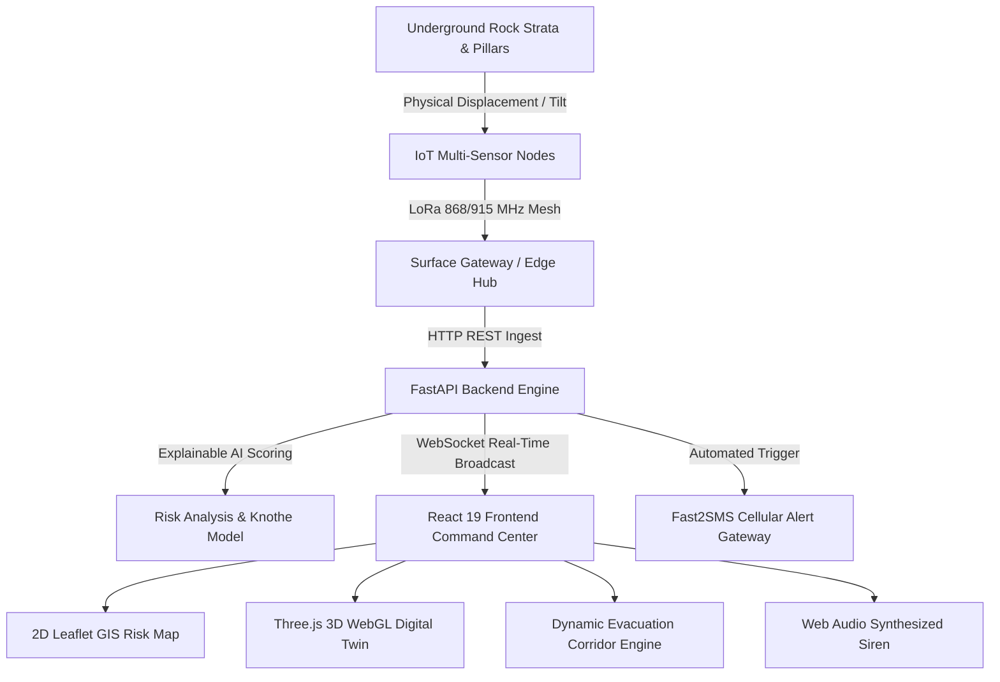
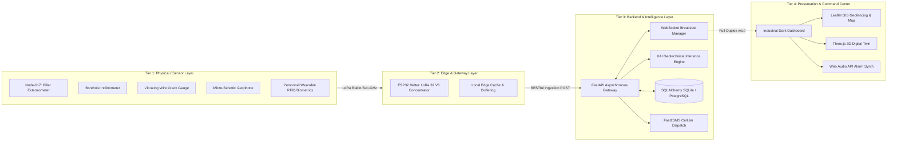
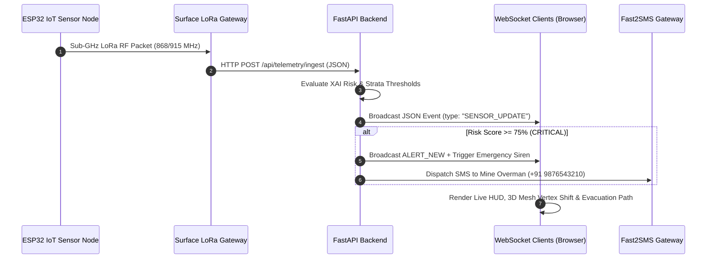

# MINEGUARD AI — Comprehensive Technical & Architecture Master Report
**Project Name**: MINEGUARD AI &bull; Underground Coal Mine Subsidence Monitoring & Safety Command Center  
**Hackathon / Initiative**: Smart India Hackathon (SIH26025)  
**Domain**: Geotechnical Risk Intelligence, IoT Telemetry, Explainable AI (XAI) & Disaster Management  
**Compliance Standard**: Directorate General of Mines Safety (DGMS) Coal Mines Regulations 2017 (Regulation 112)  

---

## 📑 Table of Contents
1. [Executive Summary & Problem Statement](#1-executive-summary--problem-statement)
2. [High-Level System Architecture](#2-high-level-system-architecture)
3. [Technology Stack & Tools Matrix](#3-technology-stack--tools-matrix)
4. [Mathematical Models & AI Algorithms](#4-mathematical-models--ai-algorithms)
5. [Multi-Tier Communication Protocols](#5-multi-tier-communication-protocols)
6. [Hardware & IoT Sensor Infrastructure](#6-hardware--iot-sensor-infrastructure)
7. [Frontend Architecture & 3D Digital Twin Engine](#7-frontend-architecture--3d-digital-twin-engine)
8. [Backend Architecture & API Specification](#8-backend-architecture--api-specification)
9. [Dynamic Evacuation & Worker Safety Protocols](#9-dynamic-evacuation--worker-safety-protocols)
10. [Deployment & Verification Guide](#10-deployment--verification-guide)

---

## 1. Executive Summary & Problem Statement

### 1.1 The Challenge
Underground coal mining (notably in geologically complex zones such as the **Jharia Coalfield** and **Raniganj Coalfield**) is subject to catastrophic structural hazards:
- **Pillar Shear & Spalling**: Bord-and-pillar extraction causes extreme vertical strain on residual crown pillars.
- **Roof Bed Separation**: Overlying shale and sandstone strata delaminate before collapse.
- **Surface Subsidence Troughs**: Ground subsidence fractures highway pavements, pipelines, rail corridors, and community dwellings.
- **Evacuation Bottlenecks**: Real-time communication underground is hindered by rock attenuation; trapped miners face blocked evacuation routes.

### 1.2 The MINEGUARD AI Solution
**MINEGUARD AI** is an end-to-end mission-critical cyber-physical command center that combines:
1. **IoT Sensor Mesh**: Underground multi-transducer nodes broadcasting over sub-GHz LoRa RF.
2. **Explainable AI (XAI) Risk Engine**: Real-time multi-factor geotechnical convergence scoring.
3. **Dynamic Evacuation Pathfinding**: Automatic detection of blocked shafts and instant rerouting to safe escapeways.
4. **3D WebGL Digital Twin**: Real-time 3D subsurface cutaway rendering strata delamination and subsidence troughs.
5. **Multi-Channel Emergency Alerting**: Synthesized control-room sirens, visual pulsing beacons, and Fast2SMS cellular dispatch.



---

## 2. High-Level System Architecture

MINEGUARD AI employs a 4-tier distributed architectural model designed for 99.9% uptime and zero-latency failover:



---

## 3. Technology Stack & Tools Matrix

### 3.1 Complete Stack Breakdown

| Layer | Technology | Version | Purpose & Technical Approach |
| :--- | :--- | :--- | :--- |
| **Frontend Framework** | React | `19.2.8` | High-performance reactive virtual DOM component rendering |
| **Frontend Bundler** | Vite | `8.2.2` | Fast HMR (Hot Module Replacement) and optimized tree-shaken bundling |
| **Styling & Theme** | Tailwind CSS | `3.4.17` | Bespoke industrial dark design tokens (`#07090e`, `#111827`, `#06B6D4`, `#F59E0B`) |
| **GIS Mapping** | Leaflet.js | `1.9.4` | Dark Matter (CartoDB) & Esri Satellite layers, SVG evacuation paths, GIS boundaries |
| **3D Graphics Engine** | Three.js | WebGL API | Hardware-accelerated 3D geological strata cross-sections, procedural terrain, shaders |
| **Data Visualization** | Recharts | `3.10.1` | Time-series graphs for displacement rates, tilt drift, crack dilation, and acoustic events |
| **Audio Alerting** | Web Audio API | Native Browser | Custom synthesized dual-oscillator siren (880Hz / 440Hz chirps) with LFO modulation |
| **Backend Framework** | FastAPI | `0.110.0+` | Asynchronous Python framework with native ASGI, auto OpenAPI docs, and WebSockets |
| **ASGI Server** | Uvicorn | `0.28.0+` | Non-blocking asynchronous event loop server supporting high-concurrency requests |
| **Data Validation** | Pydantic v2 | `2.6.0+` | Type validation, serialization, and schema enforcement for IoT payloads |
| **Database & ORM** | SQLAlchemy | `2.0.0+` | Dual-mode ORM supporting SQLite (embedded edge) and PostgreSQL (production) |
| **Hardware MCU** | ESP32-S3 | Heltec LoRa V3 | 240MHz dual-core microcontroller with onboard SX1262 LoRa transceiver & OLED |

---

## 4. Mathematical Models & AI Algorithms

### 4.1 Explainable AI (XAI) Multi-Factor Geotechnical Risk Score
To eliminate "black-box" ambiguity in life-safety operations, MINEGUARD AI computes a normalized Composite Geotechnical Risk Score $R \in [0, 100]$ using an explainable weighted regression model:

$$R = \sum_{i=1}^{5} W_i \cdot \Phi_i(X_i)$$

Where:
- **$W_1 = 0.32$ (Tilt Rate Factor)**:
  $$\Phi_1(\theta) = \min\left(100, \frac{\theta}{\theta_{\text{crit}}} \times 100\right), \quad \theta_{\text{crit}} = 5.0^\circ$$
- **$W_2 = 0.27$ (Vertical Displacement Velocity)**:
  $$\Phi_2(v) = \min\left(100, \frac{v}{v_{\text{crit}}} \times 100\right), \quad v_{\text{crit}} = 4.0\text{ mm/hr}$$
- **$W_3 = 0.18$ (Fissure / Crack Gauge Dilatation)**:
  $$\Phi_3(c) = \min\left(100, \frac{c}{c_{\text{crit}}} \times 100\right), \quad c_{\text{crit}} = 8.0\text{ mm}$$
- **$W_4 = 0.10$ (Micro-Seismic Energy & Acoustic Emission)**:
  $$\Phi_4(E) = \text{Logarithmic energy release index (0 - 100)}$$
- **$W_5 = 0.13$ (Historical Subsidence Trend & Spatial Strain)**:
  $$\Phi_5(H) = \text{Exponential moving average of previous 24-hour rate}$$

| Factor | Weight | Parameter | Critical Threshold |
| :--- | :--- | :--- | :--- |
| **Tilt Angle Change** | $32\%$ | $\theta$ | $\ge 5.0^\circ$ |
| **Displacement Rate** | $27\%$ | $v$ | $\ge 4.0\text{ mm/hr}$ |
| **Fissure / Crack Widening** | $18\%$ | $c$ | $\ge 8.0\text{ mm}$ |
| **Historical Trend Factor** | $13\%$ | $H$ | 24-hr EMA slope |
| **Micro-Seismic Vibration** | $10\%$ | $E$ | High Acoustic Frequency |

---

### 4.2 Knothe’s Time & Subsidence Trough Influence Model
For surface infrastructure impact estimation (such as NH-32 Expressway and the 33kV Substation), surface vertical displacement $S(x)$ at distance $x$ from the extraction center is calculated using **Knothe’s Influence Function**:

$$S(x) = S_{\max} \cdot \left[ \frac{1}{2} \left( 1 - \text{erf}\left(\frac{\sqrt{\pi} \cdot x}{r}\right) \right) \right]$$

Where:
- $S_{\max} = m \cdot \eta \cdot a$ (Maximum potential subsidence, with seam thickness $m$, extraction coefficient $\eta$, stowing factor $a$)
- $r = H / \tan(\beta)$ (Radius of major influence area, depth $H$, angle of draw $\beta$)
- $\text{erf}(z)$ = Standard Gaussian error function.

---

### 4.3 Dynamic Evacuation Graph & Rerouting Algorithm
Evacuation routing utilizes a modified Dijkstra / $A^*$ algorithm over the mine drift topology graph $G = (V, E)$:

$$\text{Cost}(e_{u,v}) = \frac{\text{Distance}(u, v)}{\text{Speed}_{\text{nominal}}} \times \left(1 + \kappa_{\text{roof\_compression}} + \kappa_{\text{toxic\_gas}} + \kappa_{\text{rockfall}}\right)$$

- **Condition Check**: If $\kappa_{\text{rockfall}} \to \infty$ (e.g., Crown Pillar 17-B structural failure), **Route A** is marked as `BLOCKED`.
- **Reroute Execution**: The pathfinder dynamically computes the alternative minimum-cost path via **Route B (East Airway Drift)**, reverses emergency ventilation intakes, and beams waypoint guidance to surface assembly points.

---

## 5. Multi-Tier Communication Protocols



### Protocol Matrix
1. **LoRa / LoRaWAN (868 MHz / 915 MHz)**: Long-range, ultra-low-power radio for penetrating underground rock strata and long incline roadways without requiring fiber line installations.
2. **WebSocket (`ws://` / `wss://`)**: Low-latency, full-duplex bi-directional channel for instantaneous command-room dashboard synchronization (`/ws/live-monitoring`).
3. **HTTP / REST (JSON)**: Clean standard API for historical reporting, CSV export dumps, alert acknowledgment, and simulation triggering.
4. **I2C / SPI**: Board-level synchronous serial communication between the ESP32 microcontroller and IMU/inclinometer sensors.
5. **HTTPS REST (Fast2SMS API)**: Automated SMS carrier gateway integration for off-site emergency escalation.

---

## 6. Hardware & IoT Sensor Infrastructure

### 6.1 ESP32 Heltec WiFi LoRa 32 V3 Node Specification
- **Processor**: Xtensa Dual-Core 32-bit LX7 @ 240 MHz.
- **Wireless**: SX1262 LoRa node (+21 dBm output power, high sensitivity down to -139 dBm).
- **Display**: 0.96-inch 128x64 Blue OLED screen showing local node status.
- **Power Management**: 3.7V Lithium-Polymer cell with deep sleep current $<15\mu\text{A}$ and battery percentage monitoring.

### 6.2 Underground Telemetry Transducers
1. **Borehole Inclinometer**: Measures angular deviation (tilt) in degrees with $\pm 0.05^\circ$ precision.
2. **Multipoint Extensometer**: Measures strata bed separation and roof convergence velocity in millimeters.
3. **Vibrating Wire Crack Gauge**: Monitors dilation and tension across geological fault lines.
4. **Micro-Seismic Geophone**: Detects high-frequency acoustic emissions generated by micro-fracturing in crown pillars.
5. **Environmental Gas Sensors**: Methane ($\text{CH}_4$), Carbon Monoxide ($\text{CO}$), Oxygen ($\text{O}_2$), and ambient temperature.

---

## 7. Frontend Architecture & 3D Digital Twin Engine

### 7.1 Key UI Views & Components
- **2D GIS Command Map (`RiskMap.jsx`, `Mine2DMap.jsx`)**: Renders geo-fenced mining lease boundaries, zone polygons (A, B, C, D), 48 sensor pulse markers, 126 worker positions, and animated evacuation arrows.
- **3D Digital Twin (`Mine3DScene.jsx`)**: High-performance Three.js WebGL scene with cutaway geological strata, animated ventilation airflows, borehole shafts, and procedural subsidence deformation troughs.
- **Geotechnical Analytics Engine (`AnalyticsView.jsx`)**: Interactive Recharts graphs with 1H, 6H, 24H, 7D, and 30D timeframe selectors for multi-sensor correlation.
- **Simulation Lab (`SimulationLabView.jsx`)**: Synthetic stress bench allowing safety officers to inject faults (Baseline, Watch, Warning, Critical) to evaluate emergency response procedures.
- **Worker Safety Hub (`WorkerSafetyView.jsx`, `WorkerDetailDrawer.jsx`)**: Real-time biometric vitals (Heart Rate, $\text{SpO}_2$, Depth) and geofenced safe/danger indicators.

---

## 8. Backend Architecture & API Specification

### 8.1 Core Endpoints

| Method | Endpoint | Description |
| :--- | :--- | :--- |
| `GET` | `/api/dashboard/overview` | Returns combined overview: KPIs, risk scores, sensor health, and evacuation states |
| `GET` | `/api/sensors` | Returns telemetry for all 48 deployed IoT sensor nodes |
| `GET` | `/api/sensors/{sensor_id}` | Retrieves detailed historical metrics for a specific sensor (e.g., `NODE-017`) |
| `POST` | `/api/telemetry/ingest` | Ingests real-time hardware telemetry packets from ESP32 Heltec LoRa nodes |
| `GET` | `/api/workers` | Returns live positions, health metrics, and depth for all 126 personnel |
| `GET` | `/api/zones` | Returns status, subsidence velocity, and risk level for all 4 mining zones |
| `GET` | `/api/alerts` | Lists all active alerts categorized by severity (`CRITICAL`, `WARNING`, `CAUTION`) |
| `POST` | `/api/alerts/{id}/acknowledge`| Marks an alert as acknowledged by the control-room operator |
| `POST` | `/api/alerts/send-sms` | Dispatches emergency SMS text alerts via Fast2SMS gateway |
| `POST` | `/api/evacuation/broadcast` | Triggers mine-wide emergency broadcast message and audio sirens |
| `POST` | `/api/demo/step/{step}` | Advances the automated multi-phase demo simulation state machine |
| `WS` | `/ws/live-monitoring` | Bi-directional WebSocket stream for zero-latency client synchronization |

---

## 9. Dynamic Evacuation & Worker Safety Protocols

When a crown pillar shear is predicted or detected in **Zone B**:
1. **Phase 1: Detection**: `NODE-017` reports tilt $>4.8^\circ$ and displacement $>12.4\text{ mm}$ (Subsidence rate $>3.4\text{ mm/hr}$).
2. **Phase 2: Classification**: AI risk engine updates score to **87% (CRITICAL)**.
3. **Phase 3: Route Invalidation**: Primary incline **Route A** is marked as `BLOCKED` due to roof collapse hazards.
4. **Phase 4: Dynamic Rerouting**: System recalculates escape corridor via **Route B (East Airway Drift)**.
5. **Phase 5: Automated Safeguards**: Control room triggers ventilation fan reversal to clear dust/smoke, activates the Web Audio siren, and beams SMS notifications to rescue squads.
6. **Phase 6: Safe Assembly**: 7 at-risk workers are guided into Surface Assembly Area 3 within the 28-minute prediction window.

---

## 10. Deployment & Verification Guide

### 10.1 Running the Frontend
```bash
cd frontend
npm install
npm run dev
```
*Frontend runs at `http://localhost:5173`.*

### 10.2 Running the Backend
```bash
cd backend
pip install -r requirements.txt
uvicorn main:app --reload --port 8000
```
*Interactive Swagger API documentation available at `http://localhost:8000/docs`.*

### 10.3 Testing Live Hardware Ingestion
```bash
curl -X POST "http://localhost:8000/api/telemetry/ingest" \
     -H "Content-Type: application/json" \
     -d '{
       "node_id": "NODE-017",
       "tilt": 4.8,
       "displacement": 12.4,
       "crack_width": 7.2,
       "vibration": "HIGH",
       "battery": 84,
       "zone": "Zone B"
     }'
```

---

## 🏆 Project Significance
**MINEGUARD AI** transforms traditional post-disaster mine rescue into **proactive pre-disaster prevention**. By delivering sub-millimeter subsidence surveillance, explainable AI risk intelligence, and instant dynamic rerouting, the system sets a new benchmark for mining safety and worker preservation under **Smart India Hackathon (SIH26025)**.
